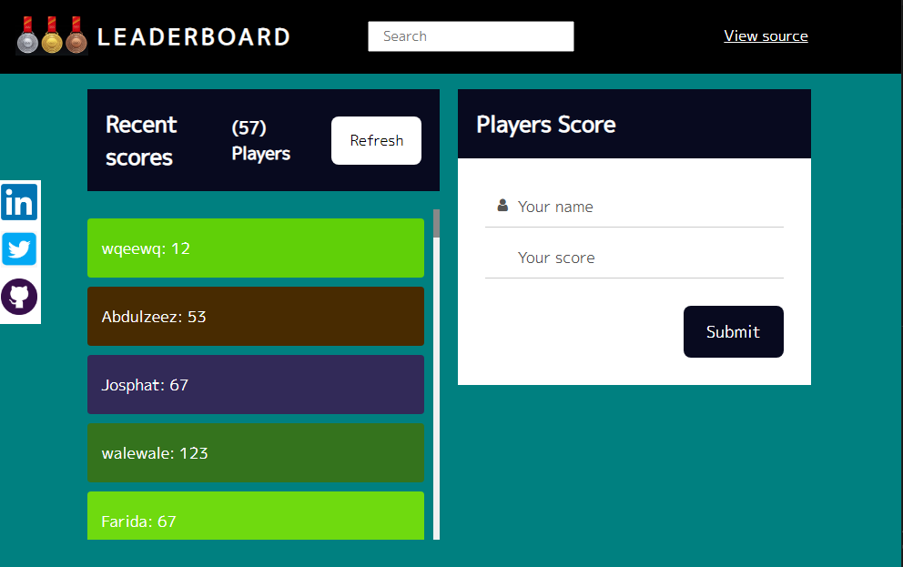
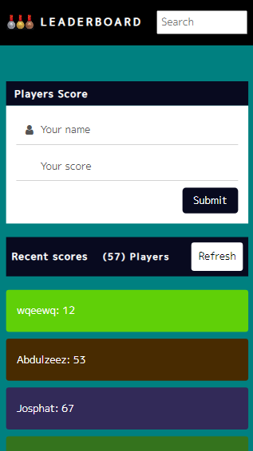

# Leaderboard App

> The leaderboard website displays scores submitted by different players. It also allows you to submit your score. All data is preserved in Leaderboard API service.


## Built With

- HTML
- CSS 
- JavaScript
- ES6
- Webpack

## Screenshots


## Getting Started

To get a local copy up and running follow these simple example steps.

### Clone this repository
Run the command

```
git clone https://github.com/abdulhamiid/leaderboard.git
```
Navigate to project directorey 
```
cd leaderboard
```

### Live Demo 

[Link here](https://https://62ef53a58e24d65022d94f6f--calm-cobbler-22d6b9.netlify.app/)

## This project is built with webpack 

- To work on this Repository Locally you need to run some command for basic Installation.
***NOTE: The minimum supported Node.js version to run webpack 5 is 10.13.0 (LTS)***
- Click Here for node Installation - [node](https://nodejs.org/en/download/) 

## Basic Setup

### Let's run npx webpack, which will take our script at src/index.js as the entry point, and will generate dist/main.js as the output.

```npx webpack```<br/>
```npx webpack --config webpack.config.js```<br/>
```npm run build```<br/>


## Setting up HtmlWebpackPlugin
### First install the plugin and adjust the webpack.config.js file:
```
npm install --save-dev html-webpack-plugin
```

### Loading CSS
```
npm install --save-dev style-loader css-loader
```

## Development
### Using webpack-dev-server
```npm install --save-dev webpack-dev-server```

### Deployment

Run ```npm start```

## Author

👤 **Abdulhamid**

- GitHub: [@githubhandle](https://github.com/abdulhamiid)
- Twitter: [@twitterhandle](https://twitter.com/abdulhamid_adio)
- LinkedIn: [LinkedIn](https://linkedin.com/)

## 🤝 Contributing

Contributions, issues, and feature requests are welcome!

Feel free to check the [issues page](https://github.com/abdulhamiid/leaderboard/issues).

## Show your support

Give a ⭐️ if you like this project!

## Acknowledgments

- Thanks to microverse

## 📝 License

This project is [MIT](./MIT.md) licensed.